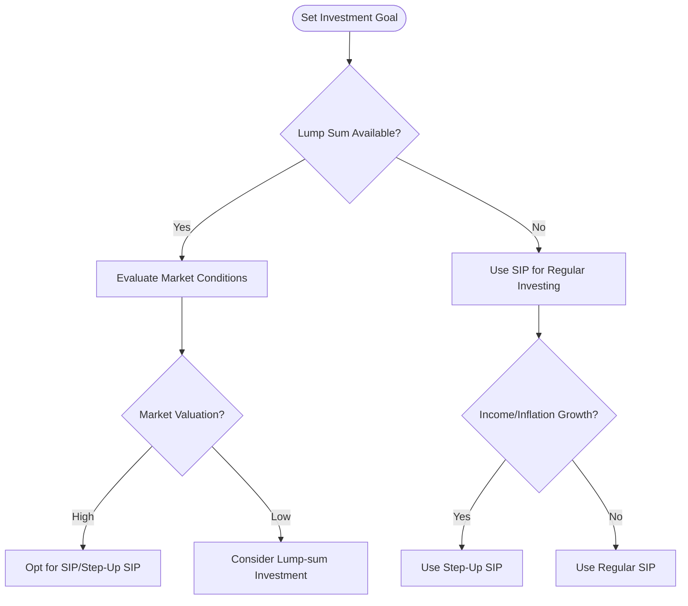

# SEO Content Brief & Article: SIP vs Lump Sum vs Fixed Deposit (India, 2026)

## 1. Topic Analysis

For the CalculHub SIP Calculator page, we propose an in-depth SEO article that answers common investor questions (for both beginners and experienced) and drives traffic. Key focus: “SIP vs Lump Sum vs FD” comparisons, rich examples and data, and clear CTAs to the SIP calculator.

## 2. Search Intent Analysis

- **Search intent:** Informational/comparative (investors want to compare SIP, lump sum, FD and use the SIP calculator).
- **Target keywords:** Primary – “SIP vs lump sum”, “SIP vs FD”, “SIP calculator”, “mutual fund SIP calculator”. Secondary – “systematic investment plan returns”, “lumpsum vs SIP returns”, “best SIP mutual fund”, etc. Long-tail – “How much will ₹10,000 SIP grow in 20 years”, “Should I invest via SIP or lump sum?”, “Regular SIP vs step-up SIP comparison”.
- **Stage in their journey:** Deciding on capital allocation strategies, assessing whether a predictable/fixed return (FD) or market-linked wealth generation (SIP/Lumpsum) aligns with their timeframe.

## 3. SEO Metadata

- **Meta title:** SIP vs Lump Sum vs FD – Calculate Returns & Maximize Wealth
- **Meta description:** Discover whether SIP, lump-sum or FD investments yield better returns. Compare scenarios with our SIP calculator and start smart investing today.
- **URL slug:** sip-vs-lumpsum-vs-fd
- **Schema recommendations:** Article schema (primary), FAQPage schema (mapping core questions), BreadcrumbList (Home → Blog → this article).

```json
{
  "@context": "https://schema.org",
  "@type": "Article",
  "headline": "SIP vs Lump Sum vs Fixed Deposit: Which Strategy Builds More Wealth?",
  "description": "Discover whether SIP, lump-sum or FD investments yield better returns. Compare scenarios with our SIP calculator and start smart investing today.",
  "author": { "@type": "Organization", "name": "CalculHub" },
  "publisher": {
    "@type": "Organization",
    "name": "CalculHub",
    "logo": { "@type": "ImageObject", "url": "https://calculhub.in/og-image.png" }
  },
  "datePublished": "2026-06-20",
  "dateModified": "2026-06-20",
  "mainEntityOfPage": { "@type": "WebPage", "@id": "https://calculhub.in/blog/sip-vs-lumpsum-vs-fd" }
}
```

```json
{
  "@context": "https://schema.org",
  "@type": "FAQPage",
  "mainEntity": [
    {
      "@type": "Question",
      "name": "SIP vs lump sum – which yields higher returns?",
      "acceptedAnswer": {
        "@type": "Answer",
        "text": "It depends on market conditions and timing. Historically, if you remain invested 7+ years, lumpsum can yield more when markets trend up continuously, but SIP reduces timing risk and often outperforms in volatile markets."
      }
    },
    {
      "@type": "Question",
      "name": "Can I lose money in SIP?",
      "acceptedAnswer": {
        "@type": "Answer",
        "text": "Yes, SIPs invest in market-linked instruments (like equity mutual funds) and returns fluctuate. Short-term results can be negative if markets fall. But staying invested long-term (7+ years) mitigates this risk."
      }
    },
    {
      "@type": "Question",
      "name": "Which mutual fund SIP is best?",
      "acceptedAnswer": {
        "@type": "Answer",
        "text": "There’s no one-size-fits-all. Large-cap or diversified index funds are generally advised for beginners. Focus on fund quality, expense ratio, and your investment goals."
      }
    },
    {
      "@type": "Question",
      "name": "How much should I start SIP with?",
      "acceptedAnswer": {
        "@type": "Answer",
        "text": "Most mutual funds in India allow you to start a SIP with as little as Rs 500 per month. The key is consistency and increasing the amount as your income grows."
      }
    },
    {
      "@type": "Question",
      "name": "Can I stop or pause my SIP?",
      "acceptedAnswer": {
        "@type": "Answer",
        "text": "Yes, SIPs are highly flexible. You can pause or stop auto-debits without penalty, though it is best to keep them running during market corrections to benefit from lower asset prices."
      }
    }
  ]
}
```

## 4. Full Article

# SIP vs Lump Sum vs Fixed Deposit: Which Strategy Builds More Wealth?

Many investors wonder whether to invest via small, regular Systematic Investment Plans (SIPs) or a one-time lump sum, or keep their money safe in a bank Fixed Deposit (FD). The answer is not one-size-fits-all. It depends on your cash flow, risk tolerance, and time horizon.

This article breaks down the features, returns, and suitability of each option using data-driven examples.

---

## What Is a Systematic Investment Plan (SIP)?

A Systematic Investment Plan (SIP) is a method of investing a fixed amount of money regularly (usually monthly) in a mutual fund. 

Key benefits of starting a SIP include:
- **Rupee Cost Averaging**: When markets fall, your monthly investment buys more mutual fund units. When markets rise, it buys fewer. Over time, this averages down your cost price.
- **Financial Discipline**: It automates your savings by auto-debiting a set amount from your bank account on a fixed date.
- **The Power of Compounding**: Regular additions, combined with reinvested gains, create exponential wealth growth over time.

---

## What Is a Lump Sum Investment?

A lump sum investment is a one-time commitment of a larger sum of money. This strategy is ideal when you receive a windfall, such as an annual bonus, a property sale payout, or an inheritance.

Unlike a SIP, a lump sum investment is highly sensitive to market timing. If you invest at the peak of a bull market, your portfolio may see short-term drops. Conversely, investing during a market correction can lead to outsized long-term gains.

---

## SIP vs Lumpsum: Key Differences

| Feature | SIP (Systematic Investment) | Lump Sum (One-Time) |
|---|---|---|
| **Market Timing Risk** | Low (Spread over cycles) | High (Depends on entry point) |
| **Rupee Cost Averaging** | Yes (Core benefit) | No |
| **Cash Flow Suitability** | Salaried / Monthly earners | Windfalls / Windfall recipients |
| **Risk Profile** | Moderate (Volatility smoothed) | High (Initial market exposure) |

---

## Who Should Choose SIP vs Lump Sum? (Decision Flowchart)



Use the [SIP Calculator](https://calculhub.in/financial/sip-calculator) to simulate your own lumpsum and SIP outcomes based on your timeframe.

---

## Data-Driven Example: SIP vs Lump Sum Returns

Let's look at a concrete mathematical comparison using real historical returns.

### Scenario 1: ₹1,00,000 Invested (SIP vs Lump Sum)

Suppose you invest ₹1,00,000 today as a lump sum vs. a SIP of ₹8,333/month for 1 year (totaling the same ₹1,00,000). The table below shows their maturity amounts over 5, 10, and 15 years at different CAGR rates.

| Duration & Rate | Lump Sum Maturity | 1-Year SIP + Grow Maturity |
|---|---|---|
| **5 Years @ 8%** | ₹1.47 Lakh | ₹1.42 Lakh |
| **5 Years @ 12%** | ₹1.76 Lakh | ₹1.68 Lakh |
| **10 Years @ 8%** | ₹2.16 Lakh | ₹2.09 Lakh |
| **10 Years @ 12%** | ₹3.11 Lakh | ₹2.96 Lakh |
| **15 Years @ 8%** | ₹3.17 Lakh | ₹3.07 Lakh |
| **15 Years @ 12%** | ₹5.47 Lakh | ₹5.22 Lakh |

*Note: Since the lump sum compounds for the full first year, it yields slightly higher returns in a steadily rising market. However, in a volatile or falling market, the SIP's rupee cost averaging typically mitigates downside risks.*

---

## SIP vs Fixed Deposit (FD): Risk & Returns

Fixed Deposits (FDs) offer guaranteed, risk-free returns. Current bank FD rates in India range between **6% and 7.5%**, depending on the bank and tenure.

Equity SIPs, on the other hand, are market-linked. While they carry higher short-term risk, historical indices like Nifty 50 show long-term returns in the range of **10% to 15% CAGR**.

### Maturity Comparison: ₹10,000/Month for 10 Years (Total ₹12 Lakh Invested)
- **Safe Fixed Deposit (RD @ 6.5%):** ₹16.93 Lakh
- **Equity Mutual Fund (SIP @ 12%):** ₹23.23 Lakh
- **Maturity Difference:** A SIP yields an extra **₹6.30 Lakh** over a 10-year horizon.

---

## The Power of Compounding

The compounding effect grows steeper the longer you stay invested. A monthly investment of ₹10,000 at 12% CAGR:
- Grows to **₹23.23 Lakh** in 10 years.
- Grows to **₹99.91 Lakh** in 20 years.

Years 15–20 contribute more to the final corpus than the entire first 15 years combined.

---

## Common SIP Mistakes to Avoid

1. **Stopping SIPs During Market Downturns**: Market corrections are when mutual fund units are cheap. Stopping auto-debits prevents you from buying at lower averages.
2. **Ignoring Inflation**: A flat ₹5,000/month SIP for 20 years will lose purchasing power. Use a **Step-Up SIP** to increase your monthly contribution by 5–10% annually.
3. **Chasing Short-term Performance**: Avoid switching mutual funds frequently based on past 6-month returns. Stay aligned with your long-term goals.

---

## Frequently Asked Questions

#### Q: SIP vs lump sum – which yields higher returns?
A: It depends on market timing. Lump sum outperforms when you buy at market bottoms, while SIP works best to smooth out risk in volatile markets.

#### Q: Can I lose money in SIP?
A: Yes. Because mutual funds are linked to market indices, your portfolio value can fall below the principal in the short term. However, the probability of negative returns decreases significantly over 7+ years.

#### Q: Which mutual fund SIP is best?
A: For beginners, broad-market index funds (like Nifty 50) or diversified large-and-mid-cap funds are ideal due to lower expense ratios and steady growth.
